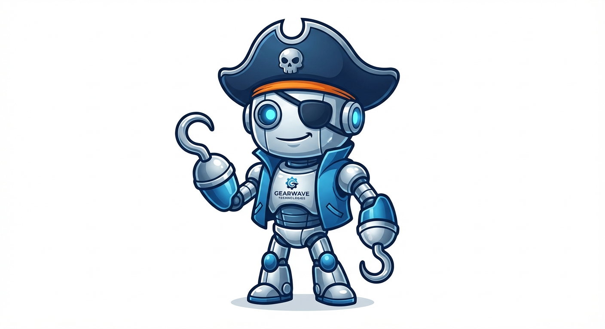

<p align="center">
  
</p>

<h1 align="center">Hooks</h1>

<p align="center">
  <strong>Manage yer agents like a pirate! Arrr! </strong>
</p>

<p align="center">
  A unified monitoring and observability platform for development workflows.<br/>
  Keep a weather eye on your Claude Code agents, runtime services, and scheduled tasks.
</p>

---

> **New to Hooks?** Check out the [Getting Started Guide](./GETTING_STARTED.md) to set sail with step-by-step instructions.

## Why Hooks?

Because every good captain needs to know what their crew is up to! Whether your AI agents are swabbing the deck (refactoring code) or hunting for buried treasure (searching files), Hooks keeps you informed in real-time.

## Features

- **Claude Code Agent Monitoring** - Keep a spyglass on your AI coding assistants across all projects
- **Runtime Monitoring** - Health checks for HTTP endpoints, TCP services, processes, and Docker containers (no scurvy services allowed!)
- **Cron Job Tracking** - Monitor scheduled tasks with miss detection and failure alerts (never miss the tide again)
- **Web Dashboard** - Real-time visualization with WebSocket updates (as fast as a ship with the wind at her back)
- **Alerts** - Configurable notifications via email, Slack, webhooks, or PagerDuty (send word by carrier parrot)

## The Crew (Architecture)

```
packages/
  cli/      - Command-line interface (the captain's orders)
  daemon/   - Background service for health checks (the lookout in the crow's nest)
  server/   - REST API and WebSocket backend (the ship's hull)
  web/      - Next.js dashboard (the treasure map)
  shared/   - Common types and utilities (the ship's provisions)
```

## Quick Start

### Prerequisites

- Node.js 20+ (the wind in yer sails)
- Docker & Docker Compose (fer containerized voyages)
- npm 10+ (the riggin')

### Hoist the Colors! (Development Setup)

1. **Clone and install dependencies:**

```bash
git clone https://github.com/fsaint/hooks.git
cd hooks
npm install
```

2. **Start development services (PostgreSQL, Redis):**

```bash
docker-compose -f docker-compose.dev.yml up -d
```

3. **Build all packages:**

```bash
npm run build
```

4. **Start the server:**

```bash
npm run dev -w @hooks/server
```

5. **Start the web dashboard (in another terminal):**

```bash
npm run dev -w @hooks/web
```

6. **Access the dashboard at `http://localhost:3000`** - X marks the spot!

## Configuration

### Server Configuration

Environment variables for the server (adjust yer headings):

| Variable | Default | Description |
|----------|---------|-------------|
| `PORT` | `3001` | API server port |
| `HOST` | `0.0.0.0` | Server host |
| `LOG_LEVEL` | `info` | Log level (debug, info, warn, error) |
| `CORS_ORIGINS` | `http://localhost:3000` | Allowed CORS origins |
| `DATABASE_URL` | - | PostgreSQL connection string |
| `REDIS_URL` | `redis://localhost:6379` | Redis connection string |

### CLI Configuration

The CLI stores configuration in `~/.hooks/config.yaml` (the captain's log):

```yaml
server:
  url: http://localhost:3001
  token: hk_your_api_token
project:
  id: your_project_id
```

### Claude Code Integration

To monitor Claude Code agents, add hooks to your `~/.claude/settings.json`:

```bash
hooks-cli setup-claude-hooks
```

Or manually configure (for ye seasoned sailors):

```json
{
  "hooks": {
    "PreToolUse": [
      {
        "matcher": "*",
        "hooks": [
          {
            "type": "command",
            "command": "hooks-cli agent-event --event pre-tool --tool $TOOL_NAME"
          }
        ]
      }
    ],
    "Stop": [
      {
        "hooks": [
          {
            "type": "command",
            "command": "hooks-cli agent-event --event stop"
          }
        ]
      }
    ]
  }
}
```

## CLI Commands

### Authentication

```bash
# Login with email/password (show yer colors!)
hooks-cli login

# Configure server URL
hooks-cli config set server.url http://localhost:3001
```

### Agent Monitoring

```bash
# Report agent event
hooks-cli agent event --type session_start --session-id <id>

# Check agent status (who's on deck?)
hooks-cli agent status
```

### Cron Monitoring

```bash
# Wrap a cron job for monitoring
hooks-cli cron wrap --name "daily-backup" -- ./backup.sh

# Report cron event manually
hooks-cli cron start --name "daily-backup"
hooks-cli cron end --name "daily-backup" --success
```

### Runtime Monitoring

```bash
# Register a runtime check (send out a scout)
hooks-cli runtime register --name "api" --type http --url https://api.example.com/health
```

## Daemon

The daemon runs health checks for configured runtimes (the tireless lookout):

```bash
# Start the daemon
hooks-daemon start

# Check daemon status
hooks-daemon status
```

Configuration file (`~/.hooks/daemon.yaml`):

```yaml
runtimes:
  - name: api-server
    type: http
    config:
      url: https://api.example.com/health
      method: GET
      expectedStatus: 200
    intervalMs: 30000
    timeoutMs: 5000
```

## API Reference

### Authentication

All API requests require a Bearer token (yer letter of marque):

```
Authorization: Bearer hk_your_token_here
```

### Endpoints

| Method | Path | Description |
|--------|------|-------------|
| `GET` | `/health` | Health check (is the ship seaworthy?) |
| `POST` | `/api/v1/auth/login` | Login |
| `POST` | `/api/v1/auth/register` | Register (join the crew) |
| `GET` | `/api/v1/projects` | List projects |
| `POST` | `/api/v1/projects` | Create project |
| `GET` | `/api/v1/agents/projects/:id/sessions` | List agent sessions |
| `POST` | `/api/v1/agents/events` | Report agent event |
| `GET` | `/api/v1/crons/projects/:id/jobs` | List cron jobs |
| `POST` | `/api/v1/crons/events` | Report cron event |
| `GET` | `/api/v1/runtimes/projects/:id` | List runtimes |
| `POST` | `/api/v1/runtimes/status` | Report runtime status |
| `GET` | `/api/v1/alerts/projects/:id/alerts` | List alerts |

### WebSocket

Connect to `/ws` for real-time updates (faster than a message in a bottle):

```javascript
const ws = new WebSocket('ws://localhost:3001/ws');

// Authenticate
ws.send(JSON.stringify({ type: 'auth', payload: { token: 'hk_...' } }));

// Subscribe to project events
ws.send(JSON.stringify({
  type: 'subscribe',
  payload: { channel: 'project', id: 'prj_...' }
}));
```

## Docker Deployment

### Full Stack (Set Sail!)

```bash
docker-compose up -d
```

### Services Only (for local development)

```bash
docker-compose -f docker-compose.dev.yml up -d
```

## Testing

```bash
# Run all tests (check for leaks in the hull)
npm test

# Run tests for specific package
npm run test -w @hooks/server
npm run test -w @hooks/cli
npm run test -w @hooks/daemon
```

## Project Structure

```
packages/
  cli/
    src/
      commands/     # CLI commands (captain's orders)
      lib/          # Utilities (ship's tools)
  daemon/
    src/
      checkers/     # Health check implementations (the lookouts)
      lib/          # Config, scheduler
  server/
    src/
      routes/       # API routes (the trade routes)
      lib/          # Auth, config, store, redis, pubsub
      schemas/      # Zod validation schemas
      db/           # Drizzle ORM schema and migrations
  web/
    src/
      app/          # Next.js app router pages
      components/   # React components
      contexts/     # Auth and WebSocket contexts
      hooks/        # Custom React hooks (see what we did there?)
      lib/          # API client
  shared/
    src/
      types/        # Shared TypeScript types
      utils/        # Shared utilities
```

## The Pirate's Code (Contributing)

1. Fork the repo (commandeer yer own vessel)
2. Create a feature branch (`git checkout -b feature/shiny-new-hook`)
3. Commit yer changes (`git commit -m 'Add some treasure'`)
4. Push to the branch (`git push origin feature/shiny-new-hook`)
5. Open a Pull Request (request to join the fleet)

## License

MIT - Free as the seven seas!

---

<p align="center">
  <em>"Why do pirates make great programmers? Because they're experts at the hook!" </em>
</p>
